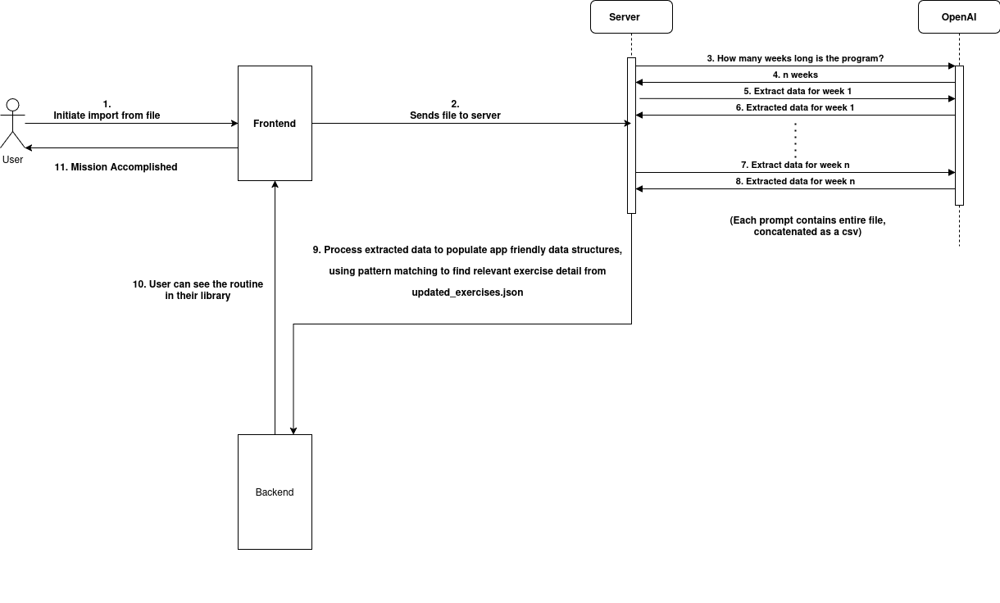

# Universal Workout Import

A tool to parse workout programs from various file formats, structure them using Gemini API, and import them into the Lyfta workout tracker.

For Docker setup instructions, see the [Docker Usage](#docker-usage) section below.

## Architecture



**Note:**
- The diagram above shows OpenAI as the LLM provider, but the current implementation uses the **Gemini Free API** instead, making the tool completely free to use.
- To ensure free usage, the app processes **one week at a time** instead of parallel processing multiple weeks parallely.

## Features

- **File Parsing:** Parses workout programs from file formats like PDF and excel.
- **AI-Powered Structuring:** Utilizes a Large Language Model (LLM) to understand and structure the workout data from the input file.
- **Exercise Matching:** Matches exercises from the source file to a predefined database of exercises for consistency.
- **Lyfta Integration:** Seamlessly uploads the structured workout program to your Lyfta account.
- **Parallel Processing:** Processes multiple weeks of a workout program in parallel for faster execution. 

## Gemini API Setup

To use the AI-powered features, you need a free Gemini API key from Google. Here’s how to get and configure it:

1. **Go to the Google AI Studio:**  
   Visit [https://aistudio.google.com/app/apikey](https://aistudio.google.com/app/apikey).

2. **Sign in with your Google Account:**  
   You’ll need to be logged in to your Google account to access the API key page.

3. **Create a new API key:**  
   Click the “Create API key” button.  
   Copy the generated key and keep it safe.

4. **Set the API key as an environment variable:**  
   You can do this in your terminal before running the app:
   ```bash
   export GEMINI_API_KEY="your-api-key-here"
   ```
   Or, if using Docker, pass it as an environment variable:
   ```bash
   docker run -e GEMINI_API_KEY="your-api-key-here" ...
   ```

5. **Set the Gemini model:**  
   Set the model (e.g., `gemini-2.5-pro`) with:
   ```bash
   export GEMINI_MODEL="gemini-2.5-pro"
   ```

**Note:** 
1. The free API key comes with usage limits. For more details, see the [Google AI Studio rate limits](https://ai.google.dev/gemini-api/docs/rate-limits).
2. gemini-2.5-pro was used for testing.

## Known Issues

See [known_issues](docs/known_issues.md) for current limitations and workarounds.

## TODO

See [TODO.md](TODO.md) for upcoming features and ways to contribute.

## License

This project is licensed under a **Custom Non-Commercial License**.  
You are free to use, modify, and distribute this code for **personal, educational, or non-commercial purposes only**.

**Commercial use is prohibited without prior written consent.**  
For commercial licensing inquiries, please contact: vidhuarora84@gmail.com

See [LICENSE](LICENSE) for details.
